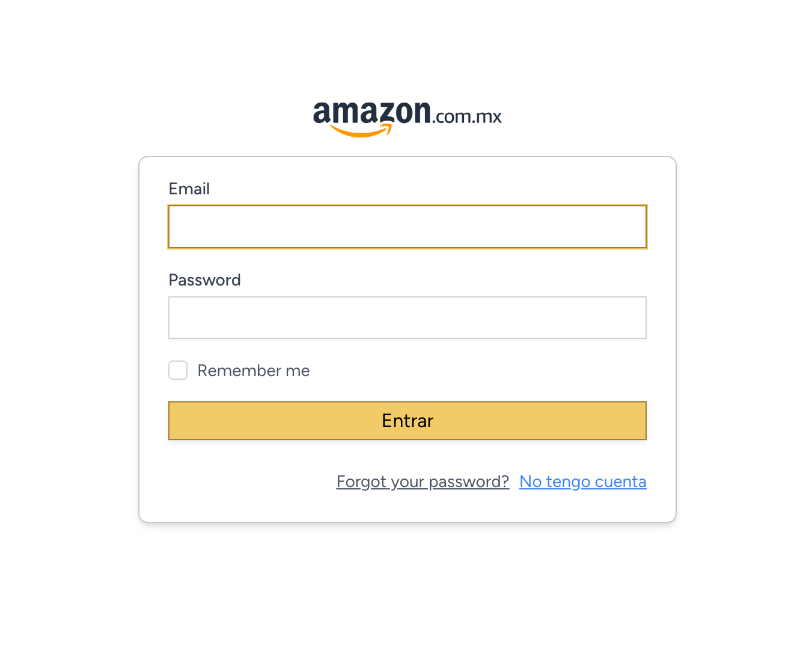
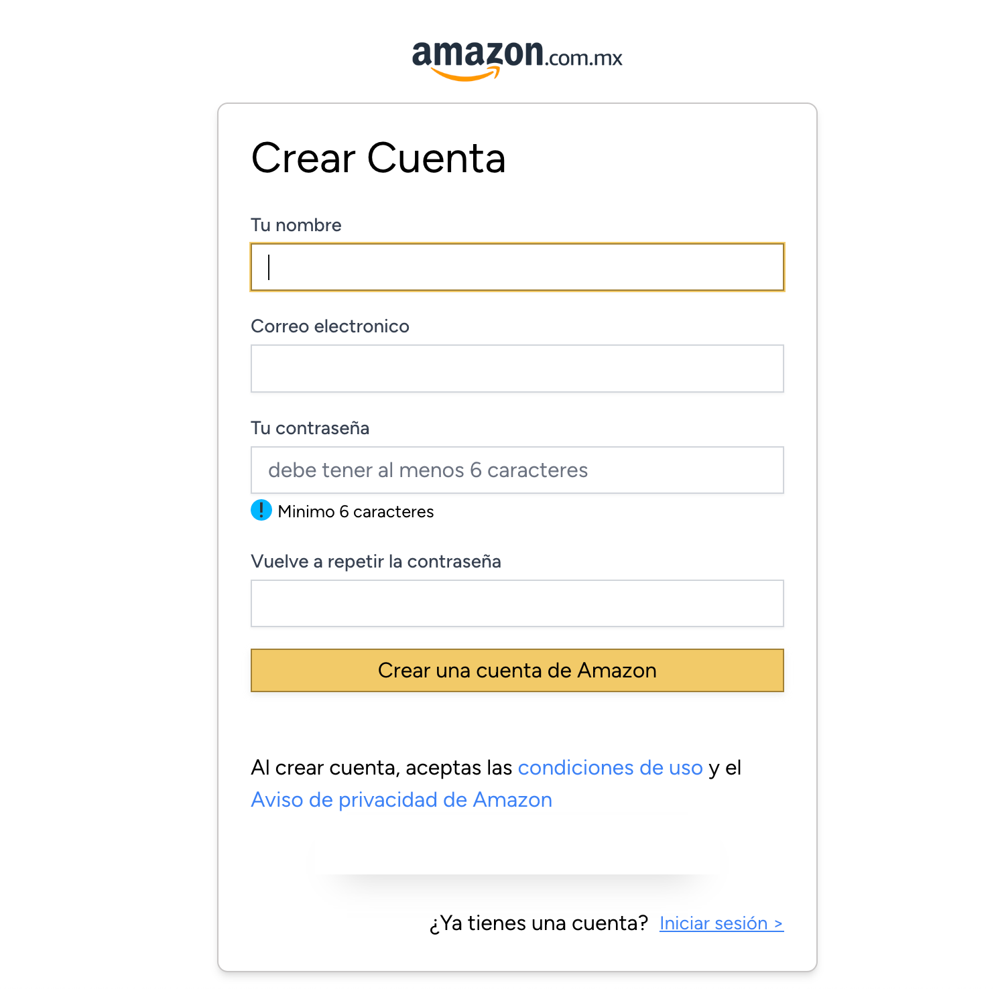
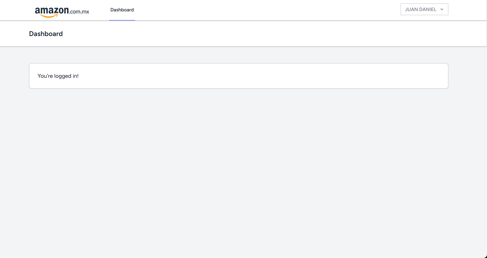
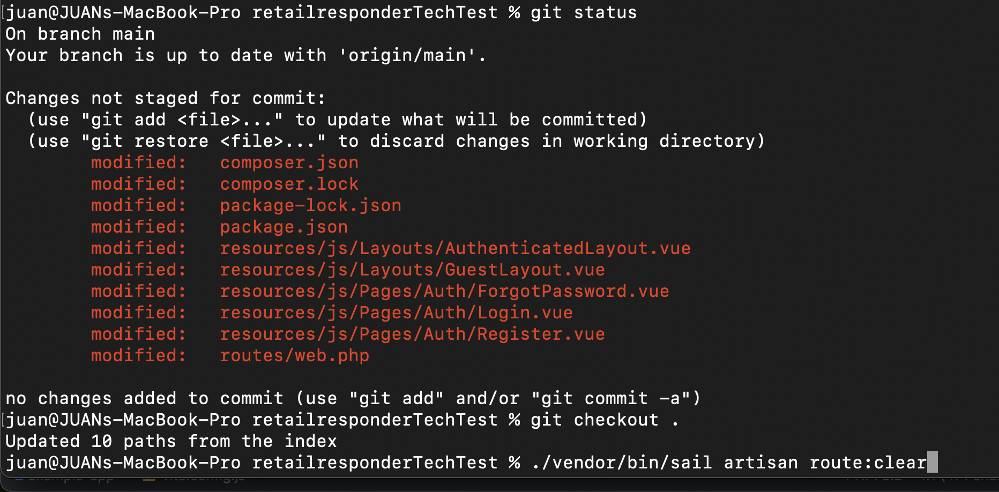

<p align="center"><a href="https://laravel.com" target="_blank"></a></p>

<p align="center">
<a href="https://github.com/laravel/framework/actions"></a>
<a href="https://packagist.org/packages/laravel/framework"></a>
<a href="https://packagist.org/packages/laravel/framework"></a>
<a href="https://packagist.org/packages/laravel/framework"></a>
</p>

# Proyecto Laravel y Vue.js

## Funcionamiento Backend

El backend de este proyecto está construido con Laravel 11. A continuación, se muestra una descripción de cómo funcionan algunas partes clave.

### Dependencias Importantes

#### Inertia.js

Cuando usas Inertia.js, las redirecciones en el controlador no causan una recarga completa de la página, porque Inertia.js intercepta las respuestas del servidor y maneja la navegación del lado del cliente.

Aquí hay una ejemplo de como se usa esta dependencia para cargar el dashboard sin recargar la pagina:

```js
//Archivo resources/js/app.js
import './bootstrap';
import '../css/app.css';

import { createApp, h } from 'vue';
import { createInertiaApp } from '@inertiajs/vue3';
import { resolvePageComponent } from 'laravel-vite-plugin/inertia-helpers';
import { ZiggyVue } from '../../vendor/tightenco/ziggy';
```

```php
##Archivo routes/web.php
Route::get('/dashboard', function () {
    return Inertia::render('Dashboard');
})->middleware(['auth', 'verified'])->name('dashboard');
```

Inertia.js está diseñado para interceptar las respuestas de redirección del servidor. Cuando el servidor responde con una redirección, Inertia.js captura esa respuesta y realiza una navegación del lado del cliente, sin recargar completamente la página.
Manejo de la Redirección por Inertia.js:

Inertia.js transforma las redirecciones del servidor en solicitudes AJAX. Cuando el servidor responde con una redirección (código de estado HTTP 302), Inertia.js realiza automáticamente una nueva solicitud AJAX a la URL de destino de la redirección.
Actualización del Estado del Cliente:

Después de realizar la nueva solicitud AJAX, Inertia.js actualiza el estado del cliente y renderiza el nuevo componente de Vue sin recargar la página. Esto proporciona una experiencia de usuario más fluida y rápida.

### Funcionamiento De Registro

Petición Ajax

```js
//Archivo resources/js/Pages/Auth/Register.vue

const submit = () => {
    form.post(route('register'), {
        onFinish: () => form.reset('password', 'password_confirmation'),
        onSuccess: (page) => {
            console.log('Register successful', page);
        },
        onError: (errors) => {
            console.log('Register errors', errors);
        },
    });
};
```

Ruta

```php
##Archivo routes/auth.php

Route::post('register', [RegisteredUserController::class, 'store']);
```

El formulario lleva al controlador

```php
## archivo app/Http/Controllers/Auth/RegisteredUserController.php

/**
 * Handle an incoming registration request.
 *
 * @throws \Illuminate\Validation\ValidationException
 */
public function store(Request $request): RedirectResponse
{
    $request->validate([
        'name' => 'required|string|max:255',
        'email' => 'required|string|lowercase|email|max:255|unique:'.User::class,
        'password' => ['required', 'confirmed', Rules\Password::defaults()],
    ]);

    $user = User::create([
        'name' => $request->name,
        'email' => $request->email,
        'password' => Hash::make($request->password),
    ]);

    event(new Registered($user));

    Auth::login($user);

    return redirect(route('dashboard', absolute: false));
}
```

Este controlador crea usuario y hace redirección al dashboard, que como ya vimos al hacerse con inertia.js vitamos que se recargue toda la pagina

```php
##Archivo routes/web.php
Route::get('/dashboard', function () {
    return Inertia::render('Dashboard');
})->middleware(['auth', 'verified'])->name('dashboard');
```


### Funcionamiento De Login


Petición Ajax

```js
//Archivo resources/js/Pages/Auth/Login.vue

const submit = () => {
    form.post(route('login'), {
        onFinish: () => form.reset('password'),
        onSuccess: (page) => {
            console.log('Login successful', page);
        },
        onError: (errors) => {
            console.log('Login errors', errors);
        },
    });
};
```

Ruta

```php
##Archivo routes/auth.php

Route::post('login', [AuthenticatedSessionController::class, 'store']);
```

El formulario lleva al controlador

```php
##Archivo app/Http/Controllers/Auth/AuthenticatedSessionController.php

/**
 * Handle an incoming authentication request.
 */
public function store(LoginRequest $request): RedirectResponse
{
    $request->authenticate();

    $request->session()->regenerate();

    return redirect()->intended(route('dashboard', absolute: false));
}
```
El mismo valida los datos y redireccióna al dashboard


## Vistas

### Login



### Registro



### Dashboard



Todo usando componentes vue.js reutilizables

## ¿Como se monta el proyecto?

El proyecto se construyó con ayuda de Docker Sail para no tener problemas con el ambiente o SO

Aqui más detalles: https://laravel.com/docs/11.x/installation#sail-on-macos

1. Clonas el repositorio en carpeta deseada

```
git clone https://github.com/JuanGit96/retailresponderTechTest.git

cd retailresponderTechTest
```

2. Levantas el docker (es necesario tener instalado docker y docker compose)

seguimos estas instruccioes para instalar sail
Es necesario tener el archivo .env (es el mismo .env.example)
https://laravel.com/docs/11.x/sail#installing-sail-into-existing-applications

3. instalas y levantas npm

Instalar Vue With Inertia

https://laravel.com/docs/11.x/starter-kits#breeze-and-inertia

4. migraciones

```
php artisan migrate

./vendor/bin/sail artisan migrate
```

Escoge el comando deacuerdo a tu entorno

5. Otros comandos

```
npm run dev

./vendor/bin/sail npm run dev
```

Escoge el comando deacuerdo a tu entorno

6. ingresas

desde el navegador puedes entrar con la url "localhost"


## PDTA:

1. El proyecto fue realizado con Laravel 11 y Vue3, usando la herramienta de laravel **"Laravel Breeze"**
2. Para la instalacion necesitas Docker, composer, php8.2, token oAuth de github
3. Tambien necesitas copiar el .env que es el mismo .env.example
4. Si no tienes npm pueses instalarlo ./vendor/bin/sail npm install o simplemente npm install dependiendo de tu entorno
5. Si no vez el diseño actual, es posible que en la instalacion laravel haya hecho cambio a los recursos

Por lo que es recomendable correr

- git status
- git checkout .


